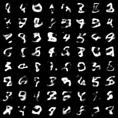

# MNIST VAE

A Variational Autoencoder implemented from scratch in PyTorch, trained to generate MNIST digits from a structured latent space. Built as the generative-modeling step between a plain autoencoder (compress and reconstruct, but can't generate) and diffusion (hierarchical, sharper generation).

## Samples

<!-- digits generated from random latents z ~ N(0, I) -->


Every digit above was generated from pure random noise — `z ~ N(0, I)` decoded into an image, with no input. A plain autoencoder can't do this; the VAE can, and that difference is the point of the architecture.

## The idea

A plain autoencoder compresses an image to a latent code and reconstructs it, but its latent space is full of "dead regions" — gaps that no training image maps to. Sample a random point and you land in a gap, and the decoder produces garbage. So a plain autoencoder can reconstruct but can't generate.

A VAE fixes this with two changes:

- **The encoder outputs a distribution, not a point.** For each image it produces a `mu` and a `logvar` — the center and spread of a Gaussian over latent codes.
- **A KL term packs the latent space toward N(0, I).** The loss penalizes each image's latent Gaussian for drifting from the standard normal, which fills the dead regions and molds the whole latent space into a smooth, gap-free, standard-normal shape.

Now sampling works: draw `z ~ N(0, I)` — the same distribution the latents were packed into — decode it, and get a plausible new digit.

## What's implemented

- **Encoder** — maps a flattened image to `mu` and `logvar` (two heads off a shared hidden layer). Outputs `logvar` rather than variance for numerical stability.
- **Reparameterization trick** — `z = mu + std * eps` with `eps ~ N(0, I)`, which externalizes the randomness so gradients can flow back through `mu` and `std` to the encoder (you can't backprop through a raw sampling operation).
- **Decoder** — maps a latent back to a reconstructed image, ending in a sigmoid so pixels land in [0, 1].
- **ELBO loss** — reconstruction (binary cross-entropy) plus the closed-form KL divergence between the encoder's Gaussian and N(0, I).

## The reconstruction–KL tradeoff

VAE samples tend to look slightly blurry. That's not a bug — it's the reconstruction term (wanting crisp detail) losing ground to the KL term (pulling everything toward N(0, I)). The blur is the visible signature of that compromise, and it's a key reason diffusion models, which don't make the same tradeoff, produce sharper images.

## Repository structure

```
vae_model.py   # VAE architecture (encoder, reparameterize, decoder) and the ELBO loss
vae_train.py   # training loop, plus a generation test that samples from N(0, I)
```

## Usage

```bash
pip install -r requirements.txt
python vae_train.py
```

Training downloads MNIST automatically, runs for 20 epochs, saves the model to `vae.pth`, and writes a grid of generated samples to `vae_samples.png`.

## Implementation details

| Component | Choice |
|---|---|
| Dataset | MNIST, flattened to 784, pixels in [0, 1] |
| Latent dimension | 20 |
| Hidden dimension | 400 |
| Optimizer | Adam, lr 1e-3 |
| Loss | BCE reconstruction + KL divergence (summed) |

Note the [0, 1] normalization: the decoder ends in a sigmoid and the reconstruction loss is binary cross-entropy, both of which expect targets in [0, 1].

## Reference

Kingma & Welling — *Auto-Encoding Variational Bayes* (2013).

## License

MIT
